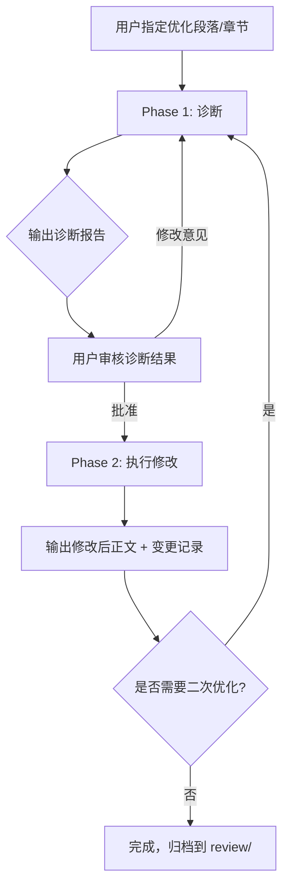

# 论文优化系统完整说明

> 本文档面向导师审阅，汇总了当前论文编辑框架中的所有规则、技能模块（Skills）和工作流程，并附带实际优化示例。

---

## 一、系统架构概览

```
firstarticle3_7/
├── AGENTS.md                          ← 总宪法：编辑原则与阶段规则
├── style/
│   ├── paper_optimization_rules.md    ← 合并后的完整优化规则（18 节）
│   ├── terminology.yml                ← 术语表与缩写首次使用控制
│   └── banned_phrases.txt             ← 禁用模板短语警告列表
├── skills/                            ← 8 个专项编辑技能模块
│   ├── paper-optimize/                ← 总调度入口
│   ├── structure-diagnose/            ← 结构诊断（只审不改）
│   ├── intro-rebuild/                 ← 引言段落重构
│   ├── abstract-optimize/             ← 摘要优化
│   ├── anti-template-rewrite/         ← 反模板化改写
│   ├── redundancy-reduce/             ← 冗余消除
│   ├── terminology-guard/             ← 术语一致性守护
│   └── writing-coach/                 ← 写作教练（嵌入式教学）
├── scripts/                           ← 确定性检查脚本
│   ├── check_terminology.py           ← 术语/缩写一致性扫描
│   ├── scan_repetition.py             ← 重复短语检测
│   └── detect_long_sentences.py       ← 长句检测
└── review/                            ← 诊断与验收输出目录
```

---

## 二、核心工作流：诊断 → 审核 → 修改

整个论文优化严格遵循分阶段执行，**不跳步、不合并**：



### Phase 1：诊断（只审不改）

针对指定段落输出以下内容：

1. **结构问题**：段落职能错位、背景混入结论、缺少桥接句
2. **逻辑鸠沟**：因果链断裂、缺失假设、比较标准不明
3. **重复热点**：跨段/跨节重复的概念解释、近义开头句
4. **AI/模板风格热点**：空洞过渡词、通用意义声明、过度自信的claim
5. **必须保留的科学内容**：方程、数值、引用锚、参数定义

每条问题标注严重性：`critical` / `major` / `moderate` / `minor`

### Phase 2：执行修改

审核通过后，输出：

1. **修改后正文**（LaTeX 代码）
2. **变更说明**（每处改动的理由）
3. **开放问题**（需要作者确认的歧义）
4. **高风险行**（未自动修改的数值/claim/引用）

---

## 三、优先级体系（从高到低）

| 优先级 | 说明 |
|--------|------|
| 1. 科学正确性 | 不为了流畅而改变科学含义 |
| 2. 作者意图 | 保留作者的原始表达意图 |
| 3. 术语一致性 | 按 `terminology.yml` 统一用词 |
| 4. 段落逻辑与修辞流 | 段落职能清晰、过渡自然 |
| 5. 简洁与风格 | 期刊级压缩、去模板化 |

---

## 四、八个技能模块详解

### 4.1 paper-optimize（总调度）

**职责**：所有论文优化请求的默认入口，负责选择和排序下层技能。

**强制执行合同**：
1. 加载治理规则（AGENTS.md + style/）
2. 确认局部范围（默认一节一任务）
3. 明确选择阶段（诊断 / 重构 / 去模板化 / 冗余消除 / 规则检查）
4. 累积应用所有非冲突规则
5. 科学含义优先于润色
6. 标记作者确认项
7. 按规定顺序返回结果

**阶段排序**（多阶段任务时）：
```
诊断 → 结构重构 → 句级去模板化 → 冗余消除 → 规则检查 → 验收输出
```

### 4.2 structure-diagnose（结构诊断）

**职责**：产出段落级诊断，**不改写任何正文**。

**审查维度**：
- 段落职能匹配度（introduction 是否变成了文献堆砌？results 是否混入 discussion？）
- Claim-证据对齐（每个重要声明是否有支撑？）
- 逻辑连续性（段落排列是否合理？因果过渡是否通顺？）
- 定义依赖序（符号是否先用后定义？）
- 信息经济性（有无重复定义、循环总结？）
- 学术语气（模板短语、空洞意义语言、过度自信且无范围限定的claim）

### 4.3 intro-rebuild（引言重构）

**职责**：修复引言的段落逻辑和贡献定位。

**目标段落结构**：
| 段号 | 职能 |
|------|------|
| ¶1 | 建立领域问题及重要性 |
| ¶2 | 总结已有工作的进展 |
| ¶3 | 揭示剩余的 gap 或方法局限 |
| ¶4 | 陈述本研究目标与方法 |
| ¶5 | 放置贡献声明（不过度宣传） |

**关键规则**：
- 贡献声明必须在 gap 清晰之后才出现
- 先做段落职能诊断，再改写
- 不把引言变成文献综述的堆砌

### 4.4 abstract-optimize（摘要优化）

**职责**：将摘要作为"受控科学压缩"处理。

**目标摘要结构**：
1. 1–2 句：领域问题与背景
2. 2–3 句：收窄背景，暴露未解决问题
3. 1 句：研究目标
4. 1 句：主要方法或核心发现
5. 2–3 句：关键结果及其相对于已有认知的贡献
6. 1–2 句：有范围限定的意义声明

**特殊规则**：
- 摘要内不用缩写，除非在摘要内首次定义
- 方法描述保持在框架层面，不枚举实现细节
- 区分"观测到的响应"、"建模解释"和"更广泛含义"

### 4.5 anti-template-rewrite（反模板化改写）

**职责**：在结构已稳定的前提下，消除机械化/通用化的学术措辞。

**需要减少的模式**：
- 重复过渡词：`it is worth noting that`, `it should be noted that`
- 生硬转折：`however`（可用句式重组替代）
- 刚性列表节奏：`first, second, finally`
- 无证据的影响力声明
- 推销性用词：`novel`, `important`, `significant`（证据窄时）
- 每句等长等功能的段落
- 填充性定义框架：`label X is used to denote`

**需要偏好的模式**：
- 证据前置句式
- 明确范围限定
- 具体比较（而非模糊赞美）
- 用逻辑过渡而非套路连接词
- 直接定义动词：`distinguishes`, `identifies`, `denotes`, `represents`

### 4.6 redundancy-reduce（冗余消除）

**职责**：压缩段内/段间自重复，但保留各段的修辞分工。

**保留 vs. 删除**：

| 保留 | 删除/压缩 |
|------|----------|
| 连续性所需的简短提醒 | 无新增细节的重复概念解释 |
| 结论中对结果的缩短重述 | 近重复的主题句 |
| 新大节首次使用的定义 | 跨段重复的套路过渡 |
| 不同修辞职能所需的短暂重叠 | 紧跟前句的无信息量总结句 |

**跨节规则**：
- 摘要简述问题/方法/结果，不复制引言
- 引言动机定位，不预讨论结果
- 结果呈现发现，讨论解释含义，结论压缩要点

### 4.7 terminology-guard（术语守护）

**职责**：高精度的术语一致性校对，而非风格改写。

**检查项目**：
- 同一概念的混合变体
- 缩写在全称之前使用
- 首次引入后应只用缩写，不再重复 `全称 (缩写)` 形式
- 符号风格：标量斜体、标注正体、向量粗体、PD 状态量加下划线
- 大小写/连字符不一致
- 键合家族分类命名在正文/图注/本构讨论之间的漂移
- 公式-散文不匹配（方程中的索引映射在正文中被省略或模糊化）

### 4.8 writing-coach（写作教练）

**职责**：在每次优化过程中嵌入教学解释，帮助用户从每次编辑中学习学术写作的语法、词汇和修辞原则。

**与其他技能的关系**：不替代任何技能，而是**叠加**在所有诊断和改写输出上，增加教学层。

**诊断阶段的教学输出**（每条问题三层解释）：
1. **问题是什么** — 当前文本中的具体问题
2. **为什么是问题** — 底层的语言学/语法/修辞原则（中文解释 + 英文术语）
3. **记忆规则** — 可复用的写作检查清单，用于未来独立写作

**改写阶段的教学输出**（每条修改附加标签化课程）：

| 编号 | 类别 | 典型问题 |
|------|------|---------|
| G1/G2 | 语法与句法 | 悬垂修饰语、被动→主动、分词短语压缩 |
| V1/V2/V3 | 词汇精度与语域 | 模糊动词→精确动词、对冲词汇使用 |
| R1/R2/R3 | 段落逻辑与衔接 | 主题句、信息结构（旧→新）、逻辑过渡 |
| C1/C2 | 句级/段级压缩 | 冗余限定语、合并低信息量句 |
| S1 | 声明校准 | 证据窄而声明宽、观测 vs 解释 |

**会话结束时**：输出"本次写作要点总结"，列出 3–5 条最重要的写作课程，标注重复出现的习惯性问题。

---

## 五、导师修订风格规则（Journal-Style Compression）

以下规则从导师的历次修订中提炼而来，应用于所有改写阶段：

### 5.1 通用压缩原则
- 在科学含义不变的前提下，偏好更短、更紧凑的句子
- 公式是重心，散文只负责定义、连接和约束公式
- 公式前后保留最低限度的物理定义句
- 偏好标准引导短语：`is defined as`, `can be expressed as`, `is denoted as`
- 削减脚手架短语：`Accordingly`, `For clarity`, `In the notation adopted here`
- 先压缩解释性填充，再考虑压缩技术定义

### 5.2 定义段落结构
- 偏好顺序：**建模目的 → 标签/符号角色 → 取值映射/分类 → 下游用途**
- 每个符号/标签一个短句（当各定义有不同职能时）
- 次要交互类型（如可忽略的键合族）用短独立句处理，不嵌入主定义行
- 定义按依赖序排列：避免在读者能理解之前就强调某符号

### 5.3 因果与衔接
- 物理性质直接驱动本构/失效规则时，偏好因果措辞：`due to ..., failure is governed by ...`
- 量从断裂能/屈服数据等导出时，偏好 `derived from` 短语
- 跨小节衔接偏好轻量前向链接：`can later be used to`
- 实现细节出现在推导内部时，简要说明其必要性

### 5.4 引用锚检查
- 引用标准理论、标定、影响函数或本构参数关系时，检查是否需要就近添加引用锚

---

## 六、禁用短语警告列表

以下短语作为**警告信号**（非盲目替换目标）：

| 短语 | 问题 |
|------|------|
| `it is worth noting that` | 空洞过渡 |
| `it should be noted that` | 空洞过渡 |
| `deserves special attention` | 空洞强调 |
| `has important significance` | 空洞意义声明 |
| `provides a new idea` | 空洞创新声明 |
| `however` | 生硬转折（可用句式重组替代时） |
| `firstly` / `secondly` / `lastly` | 刚性列表节奏 |
| `in a nutshell` / `all in all` | 非学术总结 |

---

## 七、术语表（terminology.yml）

### 缩写首次使用控制

所有以下缩写必须在首次出现时给出全称：

`CNT`, `CNTRPs`, `PD`, `OSB-PD`, `BB-PD`, `NOSB-PD`, `RVE`, `MM`, `CC`, `MC`, `CMC`, `MCM`

### 优选术语

| 全称 | 缩写 |
|------|------|
| ordinary state-based peridynamics | OSB-PD |
| representative volume element | RVE |
| interfacial debonding | — |
| quasi-static loading | — |
| Heterogeneous-bond scheme | — |
| intra-matrix bonds | MM |
| intra-CNT bonds | CC |
| interfacial bonds | MC |
| trans-phase bonds | CMC / MCM |

### 符号排版规范

| 类型 | 排版 | 示例 |
|------|------|------|
| 标量 | 斜体 | $s$, $\theta$ |
| 文字标注 | 正体 | $\text{vol}$, $\text{dev}$ |
| 向量 | 粗体 | $\boldsymbol{x}$, $\boldsymbol{u}$ |
| PD 状态量 | 下划线 | $\underline{\boldsymbol{T}}$ |
| 物质点对索引 | 括号下标 | $(k)(j)$ |

---

## 八、确定性检查脚本

| 脚本 | 功能 | 使用场景 |
|------|------|---------|
| `check_terminology.py` | 扫描混合变体、缩写首次使用错误 | 术语编辑前后 |
| `scan_repetition.py` | 检测重复短语和近重复段落开头 | 冗余消除前 |
| `detect_long_sentences.py` | 标记超长句子 | 压缩后质量检查 |

---

## 九、高风险项处理规则

以下内容视为**作者确认项**，除非用户明确指示直接修改，否则只标记不改：

- 数值、单位、阈值
- 方程定义与符号含义
- 图/表编号与交叉引用
- 因果声明、创新声明、局限性声明
- 与前人工作的比较
- 依赖未陈述实验假设的句子

---

## 十、禁止的操作

- ❌ 不发明数据、实验、引用、方程或数值结果
- ❌ 不为了流畅性而改变科学含义
- ❌ 不暗中添加创新声明、广泛影响声明或无支撑的确定性
- ❌ 不为了"一致性"改写不相关的章节
- ❌ 不进行旨在规避学术诚信检查的改写
- ❌ 当两个术语可能有不同技术含义时，不自动统一，而是标记

---

## 十一、实际优化示例

### 示例：Section 2.6 (Boundary Conditions and Loading) 的两轮优化

#### 原始版本（~180 词）
```latex
In the present PD model, boundary conditions are applied over finite
volumetric layers. Accordingly, two fictitious boundary layers, denoted
as ... are introduced at the two extremities along the global X-axis ...
Both layers have thickness ...

To focus on tensile-dominated interfacial debonding and crack evolution
in CNTRPs, the present loading setup is restricted to uniaxial tension.
Compression is not considered here [引用].

In explicit dynamic frameworks, an abrupt application of external
displacement triggers non-physical inertial stress waves. To suppress
the associated kinetic-energy peaks, the loading history is prescribed
by the fifth-order polynomial ...

At each time increment, the kinematic constraints in ... are enforced
directly. The intermediate velocities and accelerations obtained from
the momentum equations are set to zero ... This treatment suppresses
artificial wave reflections at the boundaries. It also promotes the
conversion of external work into internal elastoplastic dissipation
and fracture energy rather than parasitic kinetic energy.
```

#### 第一轮诊断发现
1. 开头 "In the present PD model ... Accordingly" → 模板式过渡词
2. "Compression is not considered here" → 多余的否定声明
3. "In explicit dynamic frameworks, an abrupt application..." → 常识性铺垫
4. 末段三句话反复论证同一个"能量转换"思想

#### 第一轮优化后（~145 词）
- 删除 `Accordingly` 和教学化起手
- 合并加载动机，删除多余否定句
- 压缩显式框架常识解释
- 三句合一句因果结构

#### 第二轮诊断发现
1. "Two ... at the two extremities" 语义重复
2. "To observe" 偏被动
3. 多项式性质独立句信息量低
4. "obtained from the momentum equations" 对读者是已知上下文

#### 最终版本（~115 词，压缩 36%）
```latex
Fictitious boundary layers $\Omega^{\text{fix}}$ and $\Omega^{\text{load}}$
are placed at opposite ends of the global $x$-axis
(Fig. ...), each with thickness $\mathcal{R}^{\text{b}} = 3\Delta x = \delta$.

To capture tensile-dominated interfacial debonding and crack evolution,
uniaxial tension is applied [引用]. Within $\Omega^{\text{fix}}$,
all degrees of freedom are constrained, [方程] ...

To suppress non-physical inertial stress waves inherent to explicit
frameworks, the loading history is prescribed by the fifth-order
polynomial [方程], where ... ensuring zero velocity and acceleration
at both endpoints.

At each time increment, the computed velocities and accelerations along
constrained degrees of freedom ... are reset to zero, suppressing
boundary reflections and ensuring that external work is channelled into
elastoplastic dissipation and fracture energy.
```

---

## 十二、总结

本系统的核心理念是：

> **用 AI 做纪律严明的论文编辑（disciplined editor），而不是自主的论文作者（autonomous author）。**

- 每次修改必须先诊断、再审核、最后执行
- 科学正确性永远高于文笔流畅性
- 导师的期刊压缩风格被编码为可复用规则
- 术语、符号、禁用短语有确定性脚本保障
- 所有高风险项（数值、方程、因果声明）标记而非自动修改
